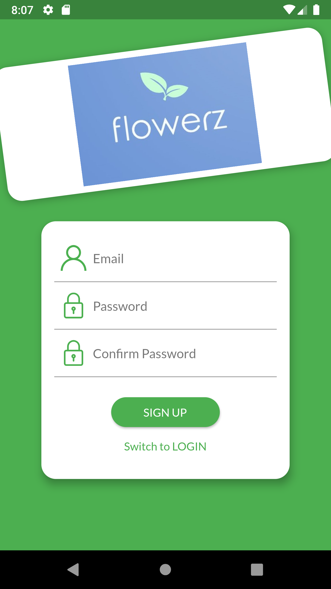
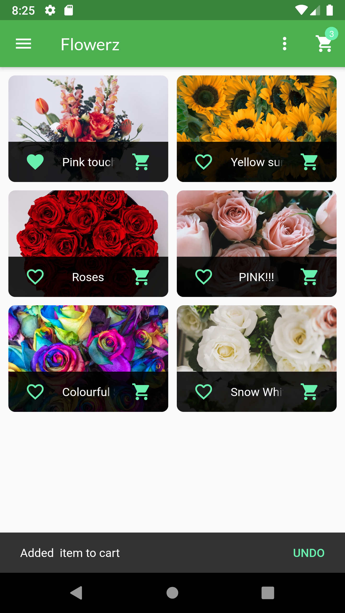
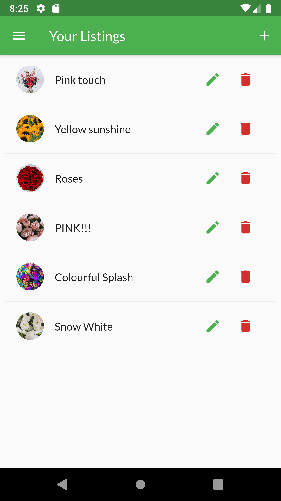
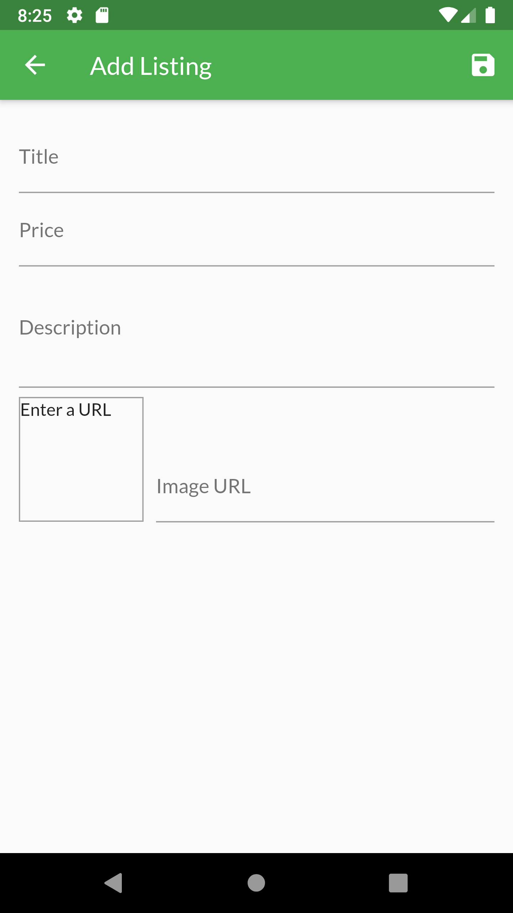
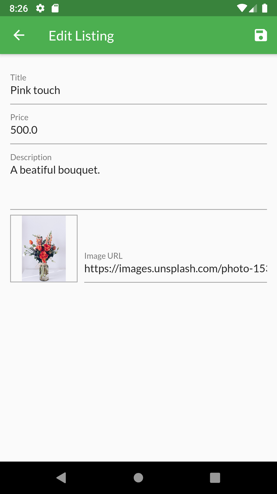
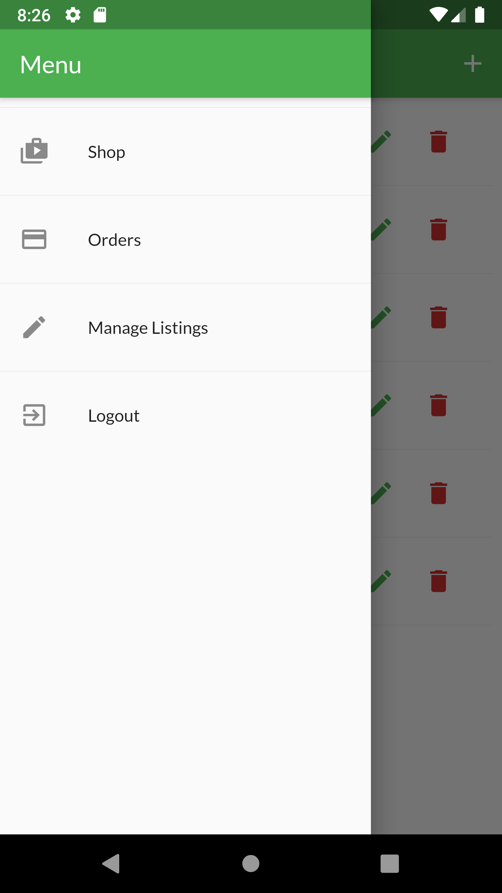
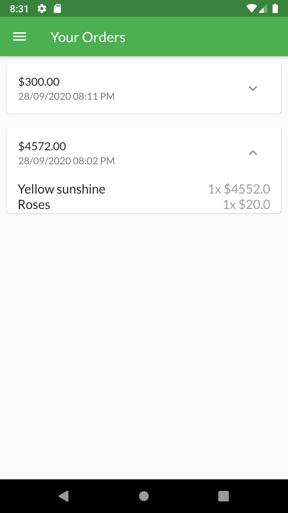
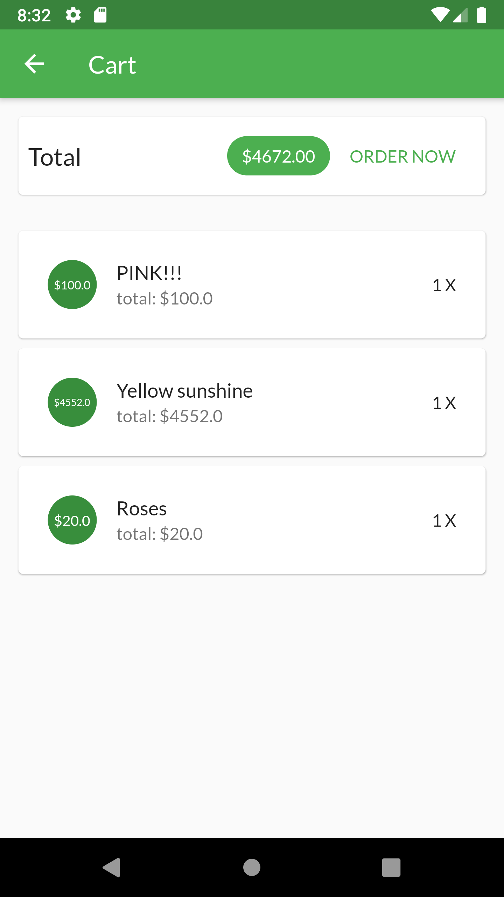
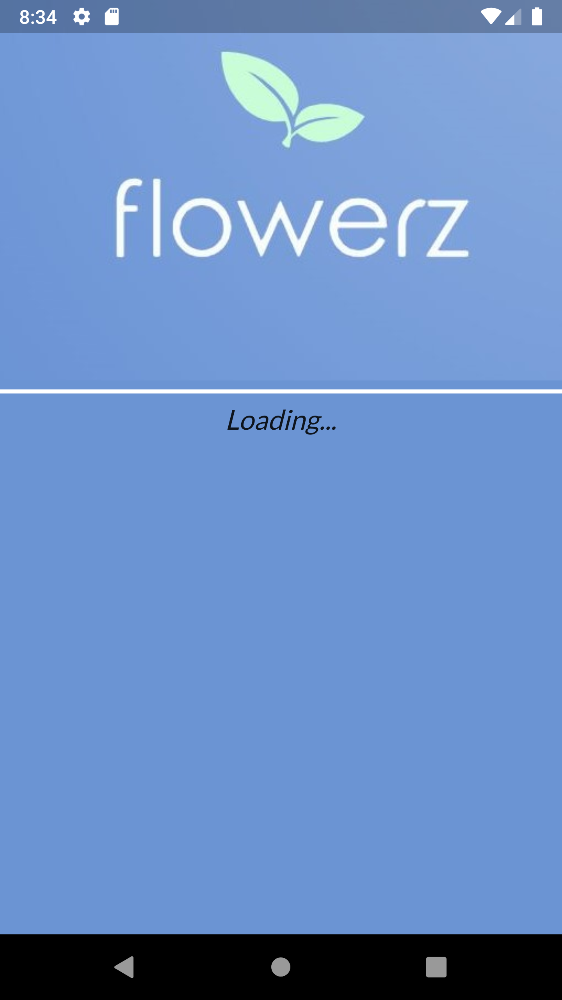

# Flowerz

I have built a simple cross-platform demo mobile application for listing flowers. This is just the client-side of the application. 

* Users can add favorites
* Users can post listings of their flowers, edit their listings and view other listings
* Users are automatically logged out after a period of time
* Users are automatically logged in during their authenticated session period.(i.e. app closing does not lead to logging in again)
* Users can add flower items to a cart and place orders

The backend is Firebase.I am using firebases's REST API for authentication and authorisation.
I am also using it to populate and update my database with POST and PATCH requests.

  

  

  

  

 

